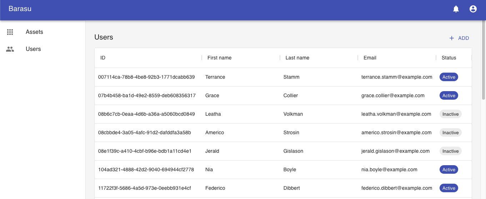

# Fullstack Typescript Multi-Tenant Web App Sample



## Technologies & Tools

### Frontend

React  
Redux/Redux-Saga  
Material-UI  
React-Hook-Form  
Webpack

### Backend

Node/Express  
Mysql/TypeORM

### Others

Docker

## Get started

```
# Build server
docker compose up app

# Setup seed data
yarn server:cli setup-dev-tenant

# Run frontend
yarn frontend start
```

## Developement Environment

```
> node -v
v16.5.0
```

### Node.js version and virtual environment management

Use nodenv.
https://github.com/nodenv/nodenv

```
> cat .node-version
16.5.0
```

## Add package

In root directory:

```
yarn frontend add hoo
yarn frontend add -D hoo

yarn server add hoo
yarn server add -D hoo
```
