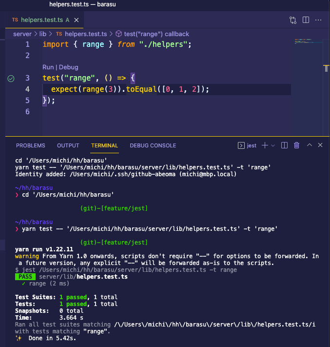

# Server-side development

## How to add model

### TypeORM

In 'server/' directory:

1. Generate TypeORM entity file

connectionName: 'admin' or 'tenant'

```
> ./typeorm.sh entity:create --connection {connectionName} --name {modelName}
```

2. Edit generated entity file

3. Generate TypeORM migration file

```
> ./typeorm.sh migration:generate --connection {connectionName} --name {modelName}
```

Must remove database name when tenant connection.

Before(auto generated):

```
export class User... implements MigrationInterface {
    name = 'User...'

    public async up(queryRunner: QueryRunner): Promise<void> {
        await queryRunner.query(`CREATE TABLE \`tenant_barasu-dev\`.\`user\` (\`id\` varchar(255) NOT NULL, ...);
    }

    public async down(queryRunner: QueryRunner): Promise<void> {
        await queryRunner.query(`DROP INDEX \`IDX_e128...\` ON \`tenant_barasu-dev\`.\`user\``);
        await queryRunner.query(`DROP TABLE \`tenant_barasu-dev\`.\`user\``);
    }

}
```

After(removed {\`tenant_barasu-dev\`.}):

```
export class User... implements MigrationInterface {
    name = 'User...'

    public async up(queryRunner: QueryRunner): Promise<void> {
        await queryRunner.query(`CREATE TABLE \`user\` (\`id\` varchar(255) NOT NULL, ...);
    }

    public async down(queryRunner: QueryRunner): Promise<void> {
        await queryRunner.query(`DROP INDEX \`IDX_e128...\` ON \`user\``);
        await queryRunner.query(`DROP TABLE \`user\``);
    }

}
```

5. Run migration

```
> ./typeorm.sh migration:run --connection {connectionName}
```

#### Other useful typeorm commands

- query "SHOW DATABASES;"
- migration:show
- migration:revert

### Prisma

1. Update schema in admin.prisma

2. Run migrate command

```
yarn server prisma:migrate --name hoo
```

## Run jest on vscode

1. Install 2 extensions:

- https://marketplace.visualstudio.com/items?itemName=Orta.vscode-jest
- https://marketplace.visualstudio.com/items?itemName=firsttris.vscode-jest-runner

2.  Add keyboard rule:

example:

```
{
  "key": "cmd+shift+r",
  "command": "extension.runJest"
}
```

ref: https://code.visualstudio.com/docs/getstarted/keybindings

3.  Press the shortcut keys on test.


